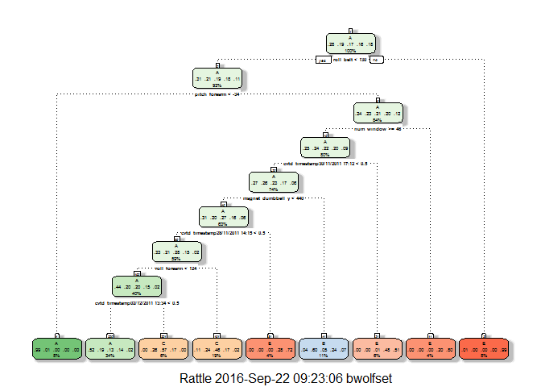
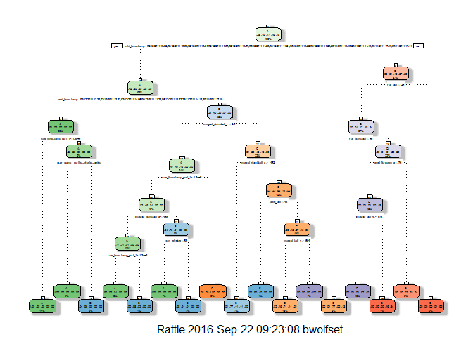

# Predicting Quality of Exercise using Personal Fitness Devices
Beth Wolfset  
September 10, 2016  


# Executive Summary
 
The goal of this project is to use data from accelerometers on the belt, forearm, arm, and dumbell of 6 participants to quantify the manner in which they did the exercise. The "classe" variable in the training set shows the outcome as levels 'A', 'B', 'C', 'D', 'E'. The project will examine the other variables and determine the best model to predict the outcome.

This report describes the model, the method of cross validation, the expected out of sample error, and the reasons behind these choices. The models are used to predict 20 different test cases.

# Background

Using devices such as Jawbone Up, Nike FuelBand, and Fitbit it is now possible to collect a large amount of data about personal activity relatively inexpensively. One thing that people regularly do is quantify how much of a particular activity they do, but they rarely quantify how well they do it. Participants were asked to perform barbell lifts correctly and incorrectly in 5 different ways.

Additional information: http://groupware.les.inf.puc-rio.br/har (see the section on the Weight Lifting Exercise Dataset).

# Data

The training data for this project are available here: https://d396qusza40orc.cloudfront.net/predmachlearn/pml-training.csv

The test data are available here: https://d396qusza40orc.cloudfront.net/predmachlearn/pml-testing.csv

The data for this project come from this source: http://groupware.les.inf.puc-rio.br/har.

The following libraries are needed to reproduce the results:


```r
#install.packages("RCurl", dependencies = TRUE)
library(RCurl)
#install.packages("lubridate", dependencies = TRUE)
library(lubridate)
#install.packages("caret", dependencies = TRUE)
library(caret)
#install.packages("rattle", dependencies = TRUE)
library(rattle)
#install.packages("randomForest", dependencies = TRUE)
library(randomForest)
```

### Load Data

The data is downloaded from the website.  A file will be written to the working directory.  It is then read into dataset variables.


```r
# Load the training dataset:
TrainingURL <- "http://d396qusza40orc.cloudfront.net/predmachlearn/pml-training.csv"
TrainingFile <- "pml-training.csv"
download.file(url=TrainingURL, destfile = TrainingFile)
TrainingDS <- read.csv(TrainingFile, na.strings=c("NA","","#DIV/0!"), header=TRUE)
TrainingColNames <- colnames(TrainingDS)

# Load test dataset:
TestingURL <- "http://d396qusza40orc.cloudfront.net/predmachlearn/pml-testing.csv"
TestingFile <- "pml-testing.csv"
download.file(url=TestingURL, destfile = TestingFile)
TestingDS <- read.csv(TestingFile, na.strings=c("NA","","#DIV/0!"), header=TRUE)
TestingColNames <- colnames(TestingDS)
# Verify that the column names are equal in the training and test set.
all.equal(TrainingColNames[1:length(TrainingColNames)-1], TestingColNames[1:length(TestingColNames)-1])
```

```
## [1] TRUE
```

This confirms that the number of columns in the Training and Testing sets is equal.  The exception is that the Training Data has the 'classe' column to use as the outcome.  The Testing set does not have a 'classe' column.  It does include a problem_id column that will be used for the submission.

### Data Cleansing OF Training Data

The training data requires cleansing.  When a column has no values for a significant portion of the rows, then it cannot be used as a predictor.  I chose to remove columns where greater than 60% of the values contained 'NA'.  This has the affect of also removing columns with significant numbers of nulls.  As a result, there are no columns with near zero variables.


```r
# Remove columns with more than 60% NA
TrainingDS <- TrainingDS[, !sapply(TrainingDS, function(y) (sum(is.na(y))/length(y)) > 0.60 )]

# Make sure classe is a factor
TrainingDS$classe <- as.factor(TrainingDS$classe)

# Remove columns with near Zero Variables - not needed once mostly NA columns removed
#Nr0Var <- nearZeroVar(TrainingDS)
#if(length(Nr0Var) > 0) TrainDSNZV <- TrainingDS[, -Nr0Var]
```

### Split Training Data Set
It is important to determine how accurate the model is by determining the out of sample error.  The training set is large which allows it to be split for cross-validation.  In this way, the models will be trained on 65% of the training set and then used to predict the other 35% of the training set.


```r
set.seed(333)
inTrain = createDataPartition(TrainingDS$classe, p=0.65)[[1]]
MyTraining = TrainingDS[ inTrain,]
MyTesting = TrainingDS[-inTrain,]

# Remove first column so it cannot be used as predictor
MyTraining <- MyTraining[c(-1)]
```

# Create the Predictive Models

I have chosen to use two types of models to predict the quality of the exercises.  The first is the RPART model to generate a decision tree and look at its accuracy.  The seconds will be Random Forests.  In addition, I have used both the 'caret' package, and the specialized packages to train the models.

The method used is to:
1. Train the model on the 65% subset of training data (MyTraining)

2. Predict the outcome of the 35% subset of training data (MyTesting)

3. Evaluate the accuracy of the model

### Recursive Partitioning and Regression Trees (Rpart) model

```r
# RPART using caret package
mdlrpart <- train(classe ~ ., data=MyTraining, method = "rpart")
```

```
## Loading required package: rpart
```

```r
# take a look at the model
print(mdlrpart, digits=3)
```

```
## CART 
## 
## 12757 samples
##    58 predictor
##     5 classes: 'A', 'B', 'C', 'D', 'E' 
## 
## No pre-processing
## Resampling: Bootstrapped (25 reps) 
## Summary of sample sizes: 12757, 12757, 12757, 12757, 12757, 12757, ... 
## Resampling results across tuning parameters:
## 
##   cp      Accuracy  Kappa 
##   0.0381  0.600     0.4835
##   0.0429  0.537     0.3939
##   0.1110  0.323     0.0576
## 
## Accuracy was used to select the optimal model using  the largest value.
## The final value used for the model was cp = 0.0381.
```

```r
# take a better look at the decision tree
fancyRpartPlot(mdlrpart$finalModel)
```

<!-- -->

```r
# predict the MyTesting data and determine accuracy.
predictrpart <- predict(mdlrpart, MyTesting )
confusionMatrix(predictrpart, MyTesting$classe)
```

```
## Confusion Matrix and Statistics
## 
##           Reference
## Prediction    A    B    C    D    E
##          A 1788  457  319  379   25
##          B   24  430   34  194   50
##          C  137  441  843  262   37
##          D    0    0    0    0    0
##          E    4    0    1  290 1150
## 
## Overall Statistics
##                                           
##                Accuracy : 0.6134          
##                  95% CI : (0.6018, 0.6249)
##     No Information Rate : 0.2845          
##     P-Value [Acc > NIR] : < 2.2e-16       
##                                           
##                   Kappa : 0.5005          
##  Mcnemar's Test P-Value : < 2.2e-16       
## 
## Statistics by Class:
## 
##                      Class: A Class: B Class: C Class: D Class: E
## Sensitivity            0.9155  0.32380   0.7043   0.0000   0.9113
## Specificity            0.7598  0.94546   0.8453   1.0000   0.9473
## Pos Pred Value         0.6024  0.58743   0.4901      NaN   0.7958
## Neg Pred Value         0.9577  0.85358   0.9312   0.8361   0.9793
## Prevalence             0.2845  0.19345   0.1744   0.1639   0.1838
## Detection Rate         0.2605  0.06264   0.1228   0.0000   0.1675
## Detection Prevalence   0.4323  0.10663   0.2505   0.0000   0.2105
## Balanced Accuracy      0.8376  0.63463   0.7748   0.5000   0.9293
```

```r
# RPART using rpart package
mdlrpart2 <- rpart(classe ~ ., data=MyTraining, method = "class")
print(mdlrpart2, digits=3)
```

```
## n= 12757 
## 
## node), split, n, loss, yval, (yprob)
##       * denotes terminal node
## 
##  1) root 12757 9130 A (0.28 0.19 0.17 0.16 0.18)  
##    2) cvtd_timestamp=02/12/2011 13:32,02/12/2011 13:33,02/12/2011 13:34,02/12/2011 14:56,02/12/2011 14:57,05/12/2011 11:23,05/12/2011 11:24,05/12/2011 14:22,05/12/2011 14:23,28/11/2011 14:13,28/11/2011 14:14,30/11/2011 17:10,30/11/2011 17:11 8088 4460 A (0.45 0.3 0.2 0.047 0)  
##      4) cvtd_timestamp=02/12/2011 13:32,02/12/2011 13:33,02/12/2011 14:56,05/12/2011 11:23,05/12/2011 14:22,28/11/2011 14:13,30/11/2011 17:10 2540  219 A (0.91 0.086 0 0 0)  
##        8) raw_timestamp_part_1< 1.32e+09 1849    0 A (1 0 0 0 0) *
##        9) raw_timestamp_part_1>=1.32e+09 691  219 A (0.68 0.32 0 0 0)  
##         18) user_name=carlitos,charles,pedro 464    0 A (1 0 0 0 0) *
##         19) user_name=adelmo 227    8 B (0.035 0.96 0 0 0) *
##      5) cvtd_timestamp=02/12/2011 13:34,02/12/2011 14:57,05/12/2011 11:24,05/12/2011 14:23,28/11/2011 14:14,30/11/2011 17:11 5548 3320 B (0.24 0.4 0.29 0.069 0)  
##       10) magnet_dumbbell_z< -2.5 2722 1450 A (0.47 0.41 0.12 0.0018 0)  
##         20) raw_timestamp_part_1< 1.32e+09 2419 1150 A (0.52 0.46 0.0095 0.0021 0)  
##           40) magnet_dumbbell_x< -458 1293  291 A (0.77 0.21 0.011 0.0039 0)  
##             80) raw_timestamp_part_1< 1.32e+09 1117  115 A (0.9 0.09 0.009 0.0045 0) *
##             81) raw_timestamp_part_1>=1.32e+09 176    4 B (0 0.98 0.023 0 0) *
##           41) magnet_dumbbell_x>=-458 1126  275 B (0.24 0.76 0.008 0 0)  
##             82) num_window< 68.5 187    0 A (1 0 0 0 0) *
##             83) num_window>=68.5 939   88 B (0.084 0.91 0.0096 0 0) *
##         21) raw_timestamp_part_1>=1.32e+09 303    0 C (0 0 1 0 0) *
##       11) magnet_dumbbell_z>=-2.5 2826 1520 C (0.013 0.39 0.46 0.13 0)  
##         22) magnet_dumbbell_x>=-462 872  204 B (0.0069 0.77 0.11 0.11 0) *
##         23) magnet_dumbbell_x< -462 1954  743 C (0.016 0.22 0.62 0.14 0)  
##           46) pitch_belt< -43.2 175   18 B (0 0.9 0.1 0 0) *
##           47) pitch_belt>=-43.2 1779  586 C (0.018 0.16 0.67 0.16 0)  
##             94) magnet_belt_y>=554 1686  493 C (0.019 0.16 0.71 0.11 0) *
##             95) magnet_belt_y< 554 93    0 D (0 0 0 1 0) *
##    3) cvtd_timestamp=02/12/2011 13:35,02/12/2011 14:58,02/12/2011 14:59,05/12/2011 11:25,05/12/2011 14:24,28/11/2011 14:15,30/11/2011 17:12 4669 2320 E (0 0.0054 0.13 0.37 0.5)  
##      6) roll_belt< 126 3491 1800 D (0 0.0072 0.17 0.49 0.34)  
##       12) roll_dumbbell< -66 710  162 C (0 0.007 0.77 0.087 0.13) *
##       13) roll_dumbbell>=-66 2781 1150 D (0 0.0072 0.015 0.59 0.39)  
##         26) accel_forearm_x< -75.5 1718  348 D (0 0.012 0.013 0.8 0.18)  
##           52) magnet_belt_y>=578 1535  195 D (0 0.013 0.015 0.87 0.099) *
##           53) magnet_belt_y< 578 183   30 E (0 0 0 0.16 0.84) *
##         27) accel_forearm_x>=-75.5 1063  280 E (0 0 0.017 0.25 0.74) *
##      7) roll_belt>=126 1178   16 E (0 0 0 0.014 0.99) *
```

```r
fancyRpartPlot(mdlrpart2)
```

<!-- -->

```r
predictrpart2 <- predict(mdlrpart2, MyTesting, type="class" )
confusionMatrix(predictrpart2, MyTesting$classe)
```

```
## Confusion Matrix and Statistics
## 
##           Reference
## Prediction    A    B    C    D    E
##          A 1868   54    7    1    0
##          B   62 1106   77   54    0
##          C   23  165 1096  112   45
##          D    0    3    9  780   64
##          E    0    0    8  178 1153
## 
## Overall Statistics
##                                           
##                Accuracy : 0.8744          
##                  95% CI : (0.8664, 0.8822)
##     No Information Rate : 0.2845          
##     P-Value [Acc > NIR] : < 2.2e-16       
##                                           
##                   Kappa : 0.8412          
##  Mcnemar's Test P-Value : NA              
## 
## Statistics by Class:
## 
##                      Class: A Class: B Class: C Class: D Class: E
## Sensitivity            0.9565   0.8328   0.9156   0.6933   0.9136
## Specificity            0.9874   0.9651   0.9391   0.9868   0.9668
## Pos Pred Value         0.9679   0.8514   0.7606   0.9112   0.8611
## Neg Pred Value         0.9828   0.9601   0.9814   0.9426   0.9803
## Prevalence             0.2845   0.1934   0.1744   0.1639   0.1838
## Detection Rate         0.2721   0.1611   0.1597   0.1136   0.1680
## Detection Prevalence   0.2811   0.1892   0.2099   0.1247   0.1950
## Balanced Accuracy      0.9719   0.8990   0.9274   0.8400   0.9402
```

The decision tree model is easy to understand.  Using the 'caret' package the accuracy is only 53%. Using the 'rpart' package the accuracy is 86%.  Is is suspicious that the models from the two packages have such a large variance.  From the diagram of the decision tree, it is easy to see that the models themselves differ significantly.

## Random Forests Model

```r
# using caret package
mdlrf <- train(classe ~ ., data=MyTraining, method = "rf")
print(mdlrf, digits=3)
```

```
## Random Forest 
## 
## 12757 samples
##    58 predictor
##     5 classes: 'A', 'B', 'C', 'D', 'E' 
## 
## No pre-processing
## Resampling: Bootstrapped (25 reps) 
## Summary of sample sizes: 12757, 12757, 12757, 12757, 12757, 12757, ... 
## Resampling results across tuning parameters:
## 
##   mtry  Accuracy  Kappa
##    2    0.987     0.983
##   41    0.998     0.998
##   80    0.997     0.996
## 
## Accuracy was used to select the optimal model using  the largest value.
## The final value used for the model was mtry = 41.
```

```r
print(mdlrf$finalModel, digits=3)
```

```
## 
## Call:
##  randomForest(x = x, y = y, mtry = param$mtry) 
##                Type of random forest: classification
##                      Number of trees: 500
## No. of variables tried at each split: 41
## 
##         OOB estimate of  error rate: 0.07%
## Confusion matrix:
##      A    B    C    D    E  class.error
## A 3627    0    0    0    0 0.0000000000
## B    3 2465    1    0    0 0.0016200891
## C    0    1 2224    0    0 0.0004494382
## D    0    0    1 2088    2 0.0014347202
## E    0    0    0    1 2344 0.0004264392
```

```r
predictrf <- predict(mdlrf, MyTesting )
confusionMatrix(predictrf, MyTesting$classe)
```

```
## Confusion Matrix and Statistics
## 
##           Reference
## Prediction    A    B    C    D    E
##          A 1953    0    0    0    0
##          B    0 1328    3    0    0
##          C    0    0 1194    0    0
##          D    0    0    0 1125    0
##          E    0    0    0    0 1262
## 
## Overall Statistics
##                                           
##                Accuracy : 0.9996          
##                  95% CI : (0.9987, 0.9999)
##     No Information Rate : 0.2845          
##     P-Value [Acc > NIR] : < 2.2e-16       
##                                           
##                   Kappa : 0.9994          
##  Mcnemar's Test P-Value : NA              
## 
## Statistics by Class:
## 
##                      Class: A Class: B Class: C Class: D Class: E
## Sensitivity            1.0000   1.0000   0.9975   1.0000   1.0000
## Specificity            1.0000   0.9995   1.0000   1.0000   1.0000
## Pos Pred Value         1.0000   0.9977   1.0000   1.0000   1.0000
## Neg Pred Value         1.0000   1.0000   0.9995   1.0000   1.0000
## Prevalence             0.2845   0.1934   0.1744   0.1639   0.1838
## Detection Rate         0.2845   0.1934   0.1739   0.1639   0.1838
## Detection Prevalence   0.2845   0.1939   0.1739   0.1639   0.1838
## Balanced Accuracy      1.0000   0.9997   0.9987   1.0000   1.0000
```

```r
# using randomForest package
mdlrf2 <- randomForest(classe ~ ., data=MyTraining)
print(mdlrf2, digits=3)
```

```
## 
## Call:
##  randomForest(formula = classe ~ ., data = MyTraining) 
##                Type of random forest: classification
##                      Number of trees: 500
## No. of variables tried at each split: 7
## 
##         OOB estimate of  error rate: 0.13%
## Confusion matrix:
##      A    B    C    D    E  class.error
## A 3626    1    0    0    0 0.0002757100
## B    2 2467    0    0    0 0.0008100446
## C    0    3 2221    1    0 0.0017977528
## D    0    0    6 2083    2 0.0038259206
## E    0    0    0    1 2344 0.0004264392
```

```r
print(mdlrf2$finalModel, digits=3)
```

```
## NULL
```

```r
predictrf2 <- predict(mdlrf2, MyTesting )
confusionMatrix(predictrf2, MyTesting$classe)
```

```
## Confusion Matrix and Statistics
## 
##           Reference
## Prediction    A    B    C    D    E
##          A 1953    0    0    0    0
##          B    0 1328    5    0    0
##          C    0    0 1192    0    0
##          D    0    0    0 1125    3
##          E    0    0    0    0 1259
## 
## Overall Statistics
##                                           
##                Accuracy : 0.9988          
##                  95% CI : (0.9977, 0.9995)
##     No Information Rate : 0.2845          
##     P-Value [Acc > NIR] : < 2.2e-16       
##                                           
##                   Kappa : 0.9985          
##  Mcnemar's Test P-Value : NA              
## 
## Statistics by Class:
## 
##                      Class: A Class: B Class: C Class: D Class: E
## Sensitivity            1.0000   1.0000   0.9958   1.0000   0.9976
## Specificity            1.0000   0.9991   1.0000   0.9995   1.0000
## Pos Pred Value         1.0000   0.9962   1.0000   0.9973   1.0000
## Neg Pred Value         1.0000   1.0000   0.9991   1.0000   0.9995
## Prevalence             0.2845   0.1934   0.1744   0.1639   0.1838
## Detection Rate         0.2845   0.1934   0.1736   0.1639   0.1834
## Detection Prevalence   0.2845   0.1942   0.1736   0.1643   0.1834
## Balanced Accuracy      1.0000   0.9995   0.9979   0.9997   0.9988
```

Using the  Random Forests model from both the 'caret' and 'randomForest' package was able to predict the MyTesting set with .99% accuracy.  That is excellent accuracy which is suspicious.  It could be that the model has been overfit and there is not enough out of sample error to prove it wrong.

# Preparing the Testing Submission

Now that the models have been trained, they are used to predict the testing data.

## Make Predictions on TestingDS

```r
# RPart from caret
predictrpartTesting <- predict(mdlrpart, TestingDS )
print(predictrpartTesting)
```

```
##  [1] C A C A A E E A A A C C C A E E A A A C
## Levels: A B C D E
```

```r
# RPart from rpart
predictrpartTesting2 <- predict(mdlrpart2, TestingDS, type="class"  )
print(predictrpartTesting2)
```

```
##  1  2  3  4  5  6  7  8  9 10 11 12 13 14 15 16 17 18 19 20 
##  B  A  C  A  A  E  D  C  A  A  B  C  B  A  E  E  A  B  B  B 
## Levels: A B C D E
```

```r
# Random Forest from caret
predictrfTesting <- predict(mdlrf, TestingDS )
print(predictrfTesting)
```

```
##  [1] B A B A A E D B A A B C B A E E A B B B
## Levels: A B C D E
```

```r
# Random Forest from randomForest - since the random forest models are so similar, only used first to predict outcomes.
#predictrfTesting2 <- predict(mdlrf2, TestingDS, type="class" )
#print(predictrfTesting2)
```

# Conclusions and Assumptions

Random Forest created a more accurate prediction model.  It took considerable more time to build this model and that will be an issue for large data sets.  The RPART model ran much faster but is also less accurate.

The expected out-of-sample error can be calculated as (1 - accuracy)

RPART using caret had Accuracy .6134 with out of sample error .3866 or 39%

RPART using rpart had Accuracy .8744 with out of sample error .1256 or 13%

Random Forest using caret had Accuracy .9996 with out of sample error .0004 or less than 1%

Random Forest using randomForest had Accuracy .9985 with out of sample error .0015 or less than 1%


I used two different r packages to run the models.
For the RPARTS model, the accuracy of the models generated differed significantly.  Similarly, the  predictions of the test data were quite different.
For the Random Forests models, both packages yielded models with similar accuracy.
